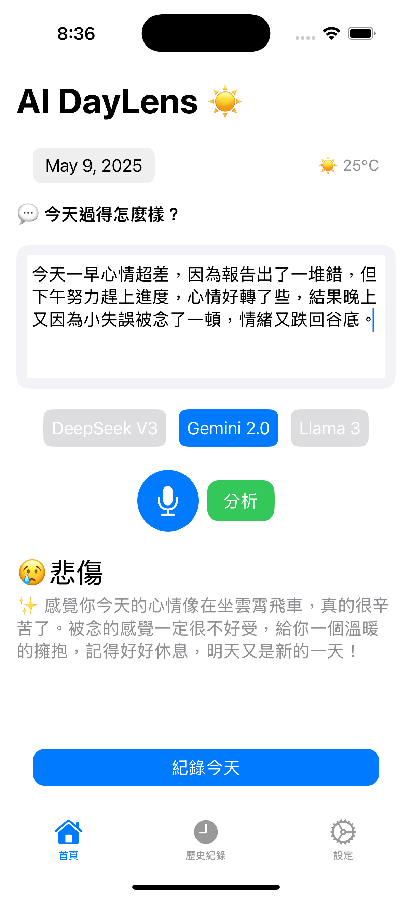
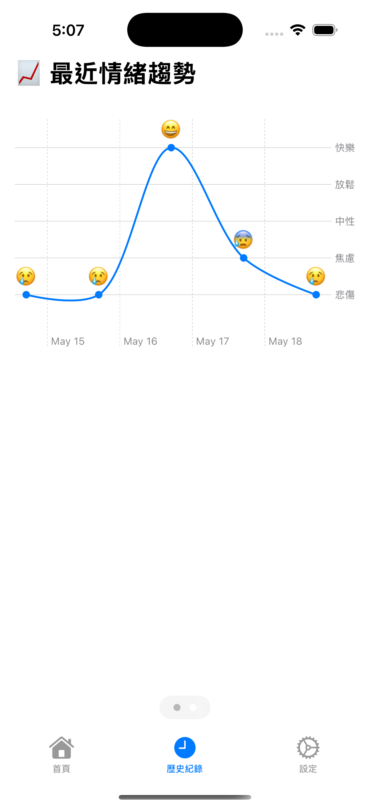
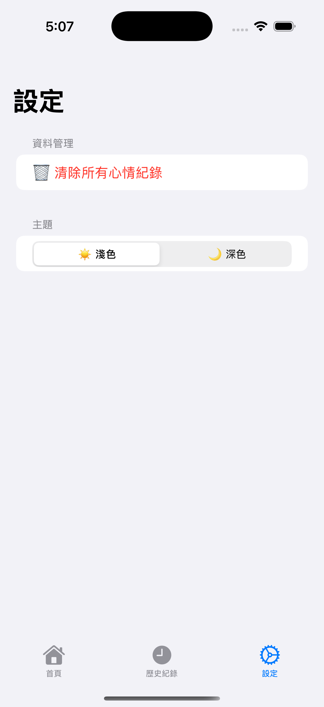
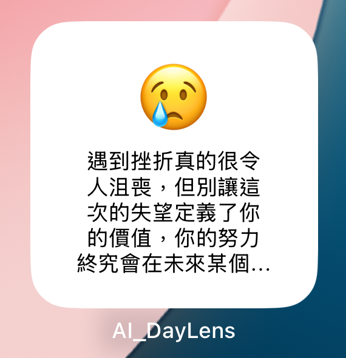
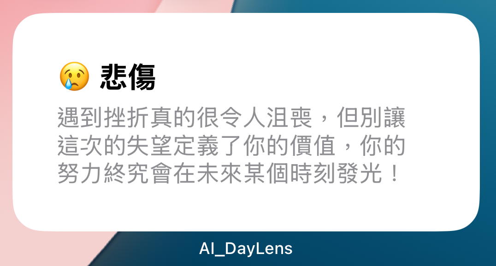

# AI_DayLens
這是一款專門紀錄每日心情，並透過AI回覆心靈小語的生活小夥伴。

- 聯絡資訊： bryan86874928@gmail.com 卓柏辰
> 此 App 中，有使用到 OpenRouter 的 API_Key，如需 Demo 還需準備一個 OpenRouter 的 API_Key。若有需求，可以聯絡我，我可以給您一個測試的 API_Key。

## Demo 畫面

### MainView - 主畫面

### HistoryView - 歷史紀錄

### TrendChartView - 情緒趨勢圖

### SettingView - 設定

### Widget
**Small**  

**Medium**  
